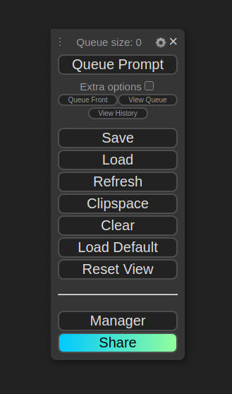
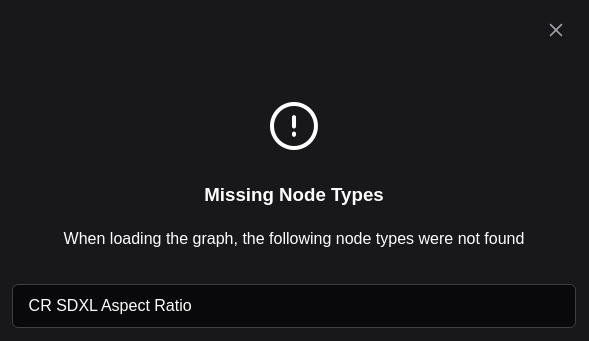
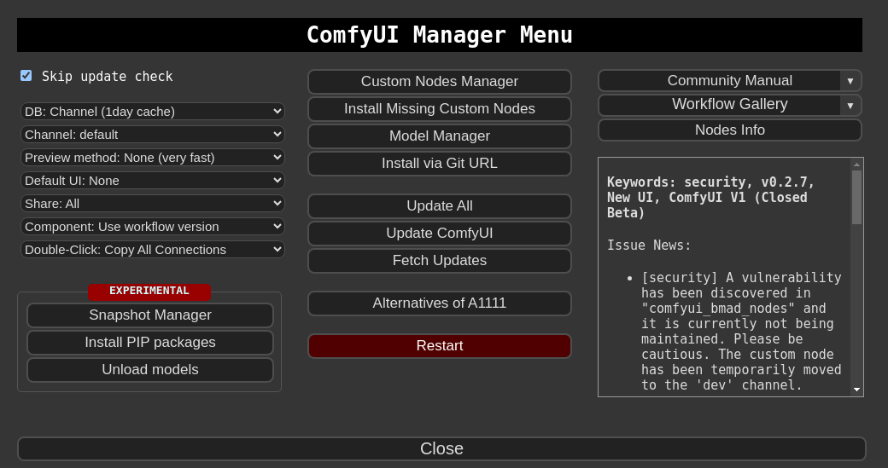
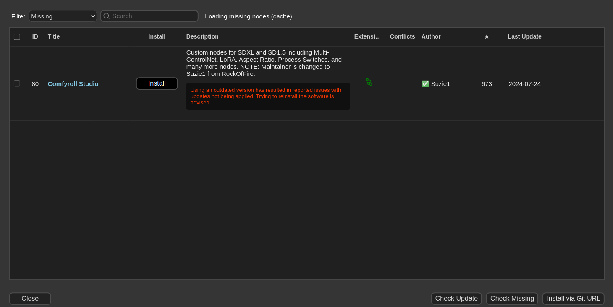
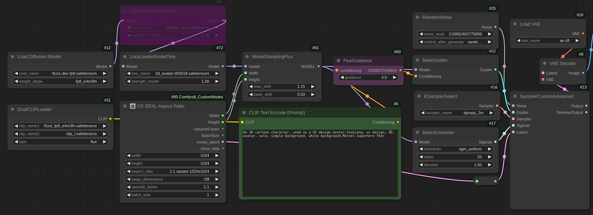

# ComfyUI: Flux 3D Cartoon Lora
https://civitai.com/models/712067/flux-lora-3d-cartoon-lora

## How to Use
1. ```chmod +x setup.sh```
2. ```sh setup.sh```
3. ```cd ComfyUI```
4. ```python main.py```

## GUI
http://127.0.0.1:8188/

### setting


When load ```workflow.json```, an error occurs. 
To resolve this, close the error window and follow these steps:

1. Go to ```Manager``` → ```Install Missing Custom Nodes```
2. Click ```Install```
3. Then, click ```Restart```

After reloading the website, the error should be resolved.








### prompt
CLIP Text Encode (Prompt): ```An 3D cartoon character, used as a UI design avatar, touxiang, ui design, 3D, avatar, solo, simple background, white background.Marvel superhero Thor```



### result

